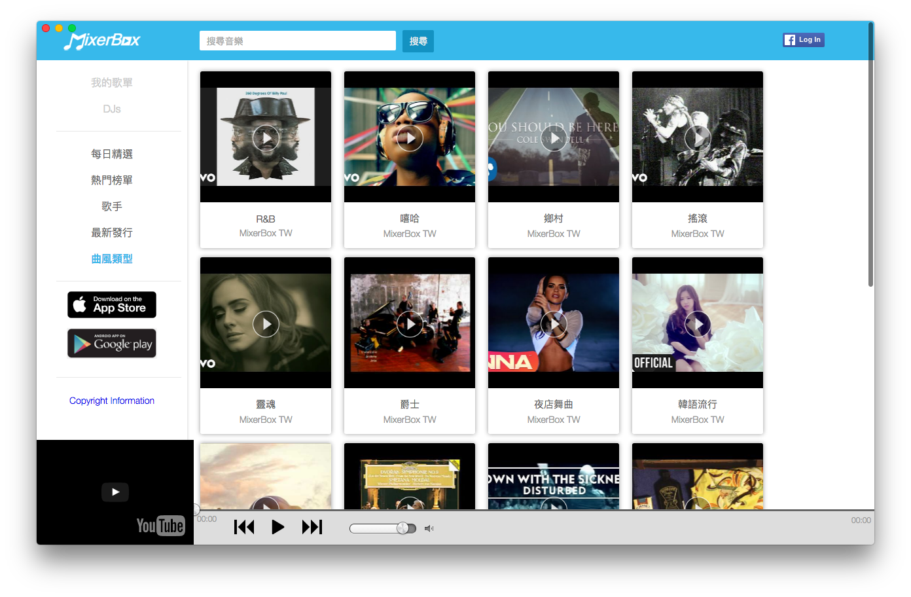
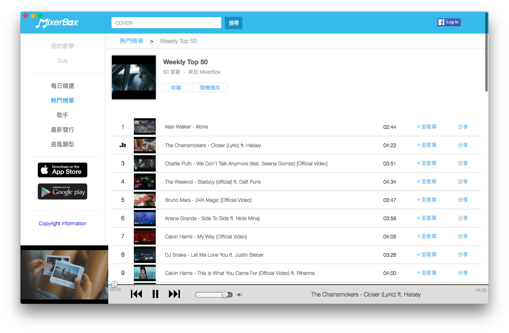

MixerBox-Desktop
========

Unofficial MixerBox as a standalone application on Desktop.


Download
--------

#### Current Release

*   [MixerBox-Desktop-macOS-v0.2.0.zip](https://github.com/pcwu/mixerbox-desktop/releases/download/v0.2.0/MixerBox-Desktop-macOS-v0.2.0.zip)


Screenshots
--------




Known Bugs and Issues
--------

#### Facebook LogIn.

Solution: After login to facebook, restart the app.

Develop
--------

Made with [Electron](http://electron.atom.io).

Init:
```bash
$ npm install
```

Run:
```bash
$ npm run start
```

Build all:
```bash
$ npm run build
```

Build macOS:
```bash
$ npm run build:osx
```

Build Windows:
```bash
$ npm run build:win32
```

Build Linux:
```bash
$ npm run build:linux
```

License
-------

[The MIT License](LICENSE).
